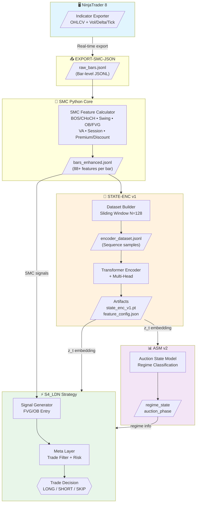
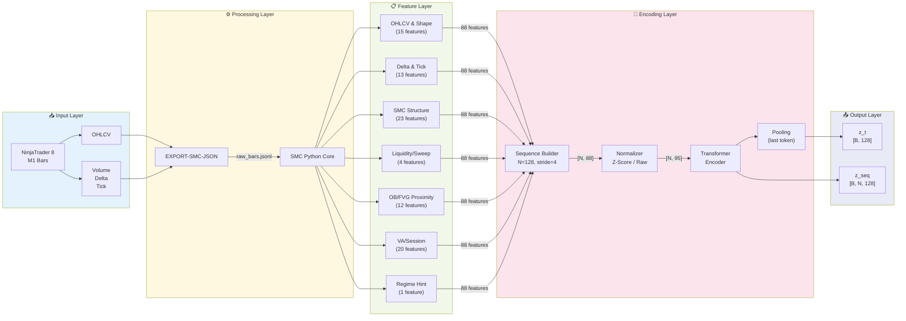
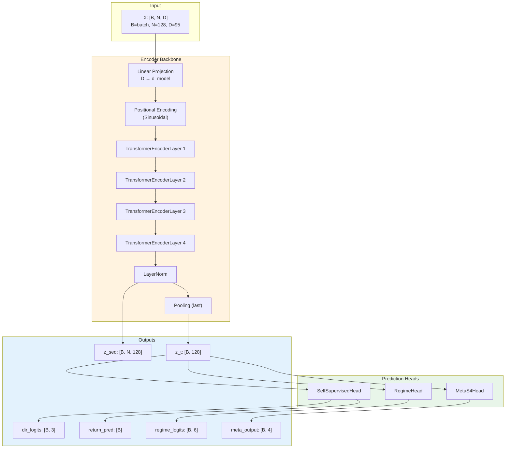
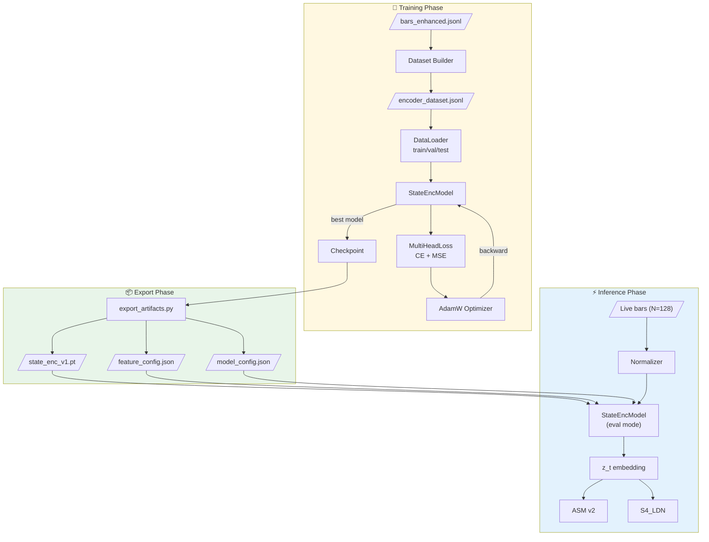
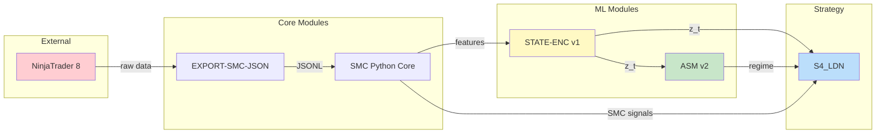
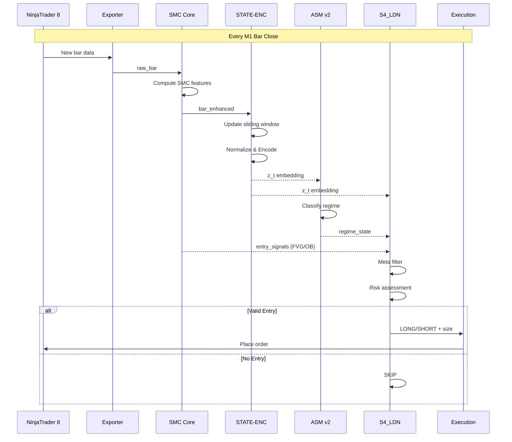

# SMC Auto-Trading System — Architecture Diagrams

> Tài liệu này chứa các sơ đồ kiến trúc cho hệ thống auto-trading SMC.

---

## 1. High-Level System Architecture (Block Diagram)

**Mô tả:** Sơ đồ tổng quan thể hiện luồng dữ liệu từ NinjaTrader 8 qua các module xử lý. Data flow chính: Raw OHLCV → SMC Features → State Encoding → Regime Detection → Trade Decision. STATE-ENC v1 đóng vai trò trung tâm, cung cấp embedding z_t cho cả ASM v2 và S4_LDN Strategy.

---

## 2. Data Pipeline Flow (Detailed)

**Mô tả:** Pipeline chi tiết từ raw data đến embedding. NinjaTrader xuất OHLCV + microstructure → SMC Core tính 88 features (7 groups) → Sequence builder tạo sliding window → Transformer encoder → Output z_t (market state) và z_seq (full sequence).

---

## 3. STATE-ENC v1 Internal Architecture

**Mô tả:** Kiến trúc nội bộ STATE-ENC v1. Input tensor [B, N, 95] đi qua Linear projection → Positional encoding → 4 Transformer layers → Pooling để lấy z_t. Ba heads dự đoán: (1) future direction/return, (2) regime classification, (3) meta output cho S4.

---

## 4. Training & Inference Pipeline

**Mô tả:** Pipeline hoàn chỉnh từ training đến inference. Training: build dataset → train với multi-head loss → save checkpoint. Export: extract best model + configs. Inference: load model → normalize live bars → encode → feed z_t vào ASM v2 và S4_LDN.

---

## 5. Module Dependency Graph

**Mô tả:** Dependency graph thể hiện quan hệ giữa các module. STATE-ENC v1 là hub trung tâm, nhận input từ SMC Core và cung cấp embedding cho cả ASM v2 và S4_LDN. S4_LDN tổng hợp tất cả signals để ra quyết định trade.

---

## 6. Real-Time Inference Flow

**Mô tả:** Sequence diagram cho real-time inference. Mỗi khi bar M1 close: data flow qua SMC → STATE-ENC encode → ASM classify regime → S4 tổng hợp signals và quyết định trade. Toàn bộ pipeline cần hoàn thành trong vài giây trước bar tiếp theo.

---

## Quick Reference

| Module | Input | Output | Role |
|--------|-------|--------|------|
| EXPORT-SMC-JSON | NT8 indicator | raw_bars.jsonl | Data export |
| SMC Python Core | raw_bars.jsonl | bars_enhanced.jsonl | Feature engineering |
| STATE-ENC v1 | bars_enhanced.jsonl | z_t, z_seq | State encoding |
| ASM v2 | z_t + meta | regime, auction_state | Regime detection |
| S4_LDN | z_t + regime + signals | trade decision | Strategy execution |
